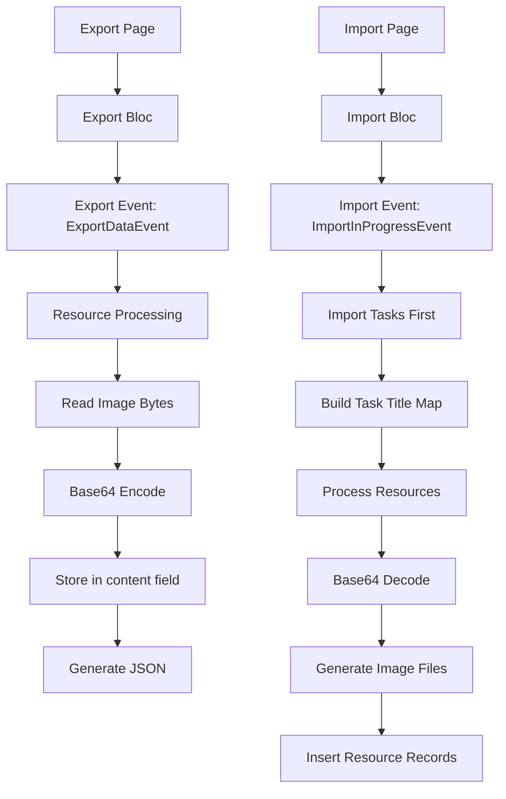

# Design Document

## Overview

本设计文档描述了基于 base64 编码的资源导出导入功能的实现方案。该方案通过将图片资源编码为 base64 字符串并嵌入到 JSON 导出文件中，消除了对外部资源文件夹的依赖，实现了真正的自包含数据导出。

### 核心改进

1. **导出侧**：将图片文件读取为字节数组，使用 base64 编码后存储在 ResourceModel 的 content 字段中
2. **导入侧**：从 JSON 中读取 base64 编码的内容，解码后生成图片文件，并通过任务标题映射建立正确的关联关系
3. **数据模型**：扩展 ResourceModel 以支持 content 字段，保持向后兼容性

## Architecture

### 组件关系图



### 数据流

**导出流程：**
1. 用户触发导出 → ExportBloc 收集数据
2. 对每个 ResourceModel，读取对应的图片文件
3. 使用 `File.readAsBytes()` 获取字节数据
4. 使用 `base64.encode()` 编码
5. 将编码结果存入 ResourceModel 的 content 字段
6. 序列化为 JSON，只包含 content 和 task_title 字段

**导入流程：**
1. 用户选择 JSON 文件 → ImportBloc 解析数据
2. 先导入所有 Task，获取实际的数据库 ID
3. 构建 `Map<String, int>` (task_title → task_id)
4. 解析资源数据，从 JSON 中加载 base64 编码的 content
5. 对每个资源创建异步任务：
   - 使用 `base64.decode()` 解码为字节数组
   - 生成文件名：`resource{id}.{extension}`
   - 写入到 resources/ 目录
   - 使用 task_title 从映射表获取 task_id
   - 插入资源记录到数据库

## Components and Interfaces

### 1. ResourceModel 扩展

**位置**: `lib/models/resource.dart`

**新增字段**:
```dart
class ResourceModel {
  // ... 现有字段 ...
  
  // 新增：用于存储 base64 编码的图片内容
  String? content;
  
  // 已有：用于导入时的临时存储
  String? taskTitle;
}
```

**更新的方法**:

```dart
// toMap - 用于导出
Map<String, dynamic> toMap() {
  return {
    'id': id,
    'path': path,
    'taskId': taskId,
    'createTime': createTime?.toIso8601String(),
    'content': content,  // 新增
    'task_title': taskTitle,  // 用于导出
  };
}

// fromMap - 用于导入
factory ResourceModel.fromMap(Map<String, dynamic> map) {
  return ResourceModel(
    id: map['id'] as int,
    path: map['path'] as String,
    taskId: map['taskId'] as int?,
    createTime: map['createTime'] != null 
        ? DateTime.parse(map['createTime'] as String)
        : null,
  )
    ..content = map['content'] as String?
    ..taskTitle = map['task_title'] as String?;
}

// copyWith
ResourceModel copyWith({
  int? id,
  String? path,
  int? taskId,
  DateTime? createTime,
  String? taskTitle,
  String? content,  // 新增
}) {
  return ResourceModel(
    id: id ?? this.id,
    path: path ?? this.path,
    taskId: taskId ?? this.taskId,
    createTime: createTime ?? this.createTime,
    taskTitle: taskTitle ?? this.taskTitle,
  )..content = content ?? this.content;
}
```

### 2. ExportBloc 修改

**位置**: `lib/bloc/export/export_bloc.dart`

**修改 `_exportData` 方法**:

```dart
FutureOr<void> _exportData(
    ExportDataEvent event, Emitter<ExportState> emit) async {
  if (state is ExportLoaded) {
    final currentState = state as ExportLoaded;
    try {
      // 创建任务ID到任务标题的映射
      final taskIdToTitle = <int, String>{};
      for (final task in currentState.tasks!) {
        if (task.id != null) {
          taskIdToTitle[task.id!] = task.title;
        }
      }

      // 转换资源数据，读取图片并编码为 base64
      final resourcesData = <Map<String, dynamic>>[];
      for (final resource in currentState.resources!) {
        try {
          // 读取图片文件
          final file = File(resource.path);
          if (await file.exists()) {
            final bytes = await file.readAsBytes();
            final base64Content = base64.encode(bytes);
            
            final taskTitle = resource.taskId != null 
                ? taskIdToTitle[resource.taskId!] 
                : null;
            
            resourcesData.add({
              'content': base64Content,
              'task_title': taskTitle,
            });
          } else {
            logger.warn('Resource file not found: ${resource.path}');
          }
        } catch (e) {
          logger.error('Error encoding resource ${resource.path}: $e');
        }
      }

      // 构建导出数据
      final exportData = {
        '__v': 2,
        'projects': currentState.projects!.map((p) => p.toMap()).toList(),
        'labels': currentState.labels!.map((l) => l.toMap()).toList(),
        'tasks': currentState.tasks!.map((t) => {
          'id': t.id,
          'title': t.title,
          'comment': t.comment,
          'dueDate': DateTime.fromMillisecondsSinceEpoch(t.dueDate)
              .toIso8601String(),
          'priority': t.priority.index,
          'status': t.tasksStatus?.index ?? 0,
          'projectName': t.projectName ?? 'Inbox',
          'order': t.order,
          'labelNames': t.labelList.map((l) => l.name).toList(),
        }).toList(),
        'resources': resourcesData,
      };

      emit(ExportSuccess(
          exportData: exportData,
          useNewFormat: event.useNewFormat,
          projects: currentState.projects,
          labels: currentState.labels,
          tasks: currentState.tasks,
          resources: currentState.resources,
          currentTab: currentState.currentTab));
    } catch (e) {
      logger.error("Error exporting data: $e");
      emit(ExportError("Failed to export data"));
    }
  }
}
```

### 3. ExportPage 修改

**位置**: `lib/pages/export/export_page.dart`

**移除 `_exportResources` 方法**:
- 删除整个 `_exportResources` 方法及其调用
- 删除 `_performExport` 方法中对 `_exportResources` 的调用

**简化后的 `_performExport` 方法**:

```dart
Future<void> _performExport(BuildContext context, ExportSuccess state) async {
  // 检查存储权限
  bool hasPermission = await _checkAndRequestStoragePermission(context);
  if (!hasPermission) {
    return;
  }

  try {
    String json;
    if (state.useNewFormat) {
      // 导出新格式 (v2)
      const encoder = JsonEncoder.withIndent('  ');
      json = encoder.convert(state.exportData);
    } else {
      // 导出旧格式 (v0)
      final tasks = state.exportData['tasks'] as List;
      const encoder = JsonEncoder.withIndent('  ');
      json = encoder.convert(tasks);
    }

    var importPath = await _getImportPath();

    if (importPath != null) {
      try {
        var file = File('$importPath');
        final dir = Directory(p.dirname(importPath));
        if (!await dir.exists()) {
          await dir.create(recursive: true);
        }

        await file.writeAsString(json);
        showSnackbar(context, 'Export Success: $importPath');
      } catch (e) {
        logger.warn('Error writing to file: $e');
        // 回退到应用文档目录
        final directory = await getApplicationDocumentsDirectory();
        final fallbackPath = p.join(directory.path, 'tasks.json');

        try {
          var file = File(fallbackPath);
          await file.writeAsString(json);
          showSnackbar(context, 'Export Success: $fallbackPath');
        } catch (e2) {
          logger.warn('Error writing to fallback location: $e2');
          showSnackbar(
            context,
            'Export Error: Storage permissions required',
            materialColor: Colors.red,
          );
        }
      }
    } else {
      showSnackbar(context, 'Export Error', materialColor: Colors.red);
    }
  } catch (e) {
    logger.warn('Export error: $e');
    showSnackbar(
      context,
      'Export Error: $e',
      materialColor: Colors.red,
    );
  }
}
```

### 4. ImportBloc 修改

**位置**: `lib/bloc/import/import_bloc.dart`

**修改 `_onImportLoadData` 方法**:

在解析资源数据部分：

```dart
// 处理资源数据（V2 格式）
if (formatVersion >= 2 && data.containsKey('resources')) {
  final resourceMaps = (data['resources'] as List).cast<Map<String, dynamic>>();
  for (var resourceMap in resourceMaps) {
    // 创建 ResourceModel，保存 base64 内容和 task_title
    final resource = ResourceModel(
      id: 0,  // 将由数据库分配
      path: '',  // 临时占位，稍后生成
      taskId: -1,  // 占位值
      createTime: DateTime.now(),
    )
      ..content = resourceMap['content'] as String?
      ..taskTitle = resourceMap['task_title'] as String?;
    
    resources.add(resource);
  }
}
```

**重写 `_handleResourceImport` 方法**:

```dart
Future<void> _handleResourceImport(ImportInProgressEvent event) async {
  final resourceStartTime = DateTime.now();
  
  try {
    // 获取任务标题到 ID 的映射
    final allTaskTitles = event.tasks.map((t) => t.title).toList();
    final actualTasks = await _taskDB.getTasksByTitles(allTaskTitles);
    final taskTitleToId = <String, int>{};
    for (final task in actualTasks) {
      if (task.id != null) {
        taskTitleToId[task.title] = task.id!;
      }
    }
    
    // 获取 resources 目录路径
    final resourcesDir = await _getResourcesDirectory();
    if (!await resourcesDir.exists()) {
      await resourcesDir.create(recursive: true);
    }
    
    // 过滤有效的资源（有 content 和 task_title）
    final validResources = <ResourceModel>[];
    
    for (final resource in event.resources) {
      if (resource.content != null && resource.taskTitle != null) {
        final taskId = taskTitleToId[resource.taskTitle!];
        if (taskId != null) {
          validResources.add(resource.copyWith(taskId: taskId));
        } else {
          logger.warn('Task not found for resource: ${resource.taskTitle}');
        }
      }
    }
    
    // 批量插入资源记录（先插入占位路径）
    if (validResources.isNotEmpty) {
      final insertedResourceIds = await _resourceDB.batchInsertResources(
        validResources.map((r) => r.copyWith(path: 'placeholder')).toList()
      );
      
      // 异步处理图片文件生成
      _generateResourceFilesAsync(
        validResources, 
        insertedResourceIds, 
        resourcesDir.path
      );
      
      logger.info('${validResources.length} resources prepared for import');
    }
    
    final resourceDuration = DateTime.now().difference(resourceStartTime);
    logger.info('Resource import completed in ${resourceDuration.inMilliseconds}ms');
  } catch (e) {
    logger.error('Resource import failed: $e');
    // 不抛出异常，让主导入流程继续
  }
}

/// 异步生成资源文件
void _generateResourceFilesAsync(
  List<ResourceModel> resources,
  List<int> resourceIds,
  String resourcesDirPath,
) {
  Future.microtask(() async {
    try {
      for (int i = 0; i < resources.length; i++) {
        final resource = resources[i];
        final resourceId = resourceIds[i];
        
        if (resource.content == null) continue;
        
        try {
          // 解码 base64
          final bytes = base64.decode(resource.content!);
          
          // 推断文件扩展名（从原始 path 或默认为 jpg）
          String extension = 'jpg';
          if (resource.path.isNotEmpty) {
            extension = resource.path.split('.').last;
          }
          
          // 生成新文件名
          final fileName = 'resource$resourceId.$extension';
          final filePath = p.join(resourcesDirPath, fileName);
          
          // 写入文件
          final file = File(filePath);
          await file.writeAsBytes(bytes);
          
          // 更新数据库中的路径
          await _resourceDB.updateResourcePath(resourceId, filePath);
          
          logger.info('Resource file generated: $filePath');
        } catch (e) {
          logger.error('Error generating resource file for ID $resourceId: $e');
        }
      }
    } catch (e) {
      logger.warn('Error in async resource file generation: $e');
    }
  });
}

/// 获取 resources 目录
Future<Directory> _getResourcesDirectory() async {
  if (Platform.isAndroid) {
    final dir = await getExternalStorageDirectory();
    return Directory(p.join(dir!.path, 'resources'));
  } else {
    final dir = await getApplicationDocumentsDirectory();
    return Directory(p.join(dir.path, 'resources'));
  }
}
```

**移除旧的资源处理逻辑**:
- 删除对 resources 文件夹存在性的检查
- 删除 `_copyResourcesAsync` 方法
- 删除文件复制相关代码

## Data Models

### ResourceModel 字段说明

| 字段 | 类型 | 必需 | 说明 |
|------|------|------|------|
| id | int | 是 | 资源的数据库 ID |
| path | String | 是 | 资源文件的本地路径 |
| taskId | int? | 否 | 关联的任务 ID |
| createTime | DateTime? | 否 | 创建时间 |
| taskTitle | String? | 否 | 任务标题（仅用于导入时的临时存储） |
| content | String? | 否 | Base64 编码的图片内容（仅用于导出/导入） |

### 导出 JSON 格式（V2）

```json
{
  "__v": 2,
  "projects": [...],
  "labels": [...],
  "tasks": [...],
  "resources": [
    {
      "content": "iVBORw0KGgoAAAANSUhEUgAA...",
      "task_title": "My Task Title"
    }
  ]
}
```

## Error Handling

### 导出错误处理

1. **文件读取失败**：
   - 记录警告日志
   - 跳过该资源，继续处理其他资源
   - 不中断整个导出流程

2. **Base64 编码失败**：
   - 记录错误日志
   - 跳过该资源
   - 继续处理其他资源

3. **JSON 生成失败**：
   - 记录错误日志
   - 向用户显示错误消息
   - 返回 ExportError 状态

### 导入错误处理

1. **Base64 解码失败**：
   - 记录错误日志
   - 跳过该资源
   - 继续处理其他资源

2. **文件写入失败**：
   - 记录错误日志
   - 跳过该资源
   - 继续处理其他资源

3. **任务映射失败**（找不到对应的任务）：
   - 记录警告日志
   - 跳过该资源
   - 继续处理其他资源

4. **数据库插入失败**：
   - 记录错误日志
   - 不中断主导入流程
   - 资源导入失败不影响任务和项目的导入

## Testing Strategy

### 单元测试

1. **ResourceModel 测试**：
   - 测试 toMap 方法包含 content 字段
   - 测试 fromMap 方法正确解析 content 字段
   - 测试 copyWith 方法正确复制 content 字段
   - 测试向后兼容性（content 为 null 时）

2. **Base64 编码/解码测试**：
   - 测试图片字节数组的编码
   - 测试 base64 字符串的解码
   - 测试编码后解码的数据一致性

### 集成测试

1. **导出流程测试**：
   - 创建包含资源的任务
   - 触发导出
   - 验证 JSON 中包含 base64 编码的 content
   - 验证 task_title 正确映射

2. **导入流程测试**：
   - 准备包含 base64 资源的 JSON 文件
   - 触发导入
   - 验证任务正确导入
   - 验证资源文件正确生成
   - 验证资源与任务的关联正确

3. **端到端测试**：
   - 导出包含资源的数据
   - 清空数据库
   - 导入刚才导出的数据
   - 验证所有数据和资源完整恢复

### 性能测试

1. **大文件处理**：
   - 测试导出包含大量图片的数据
   - 测试导入包含大量图片的数据
   - 验证内存使用合理
   - 验证处理时间可接受

2. **并发处理**：
   - 测试异步资源文件生成的并发性能
   - 验证不会出现文件锁定问题

## Migration and Compatibility

### 向后兼容性

1. **ResourceModel**：
   - content 字段为可选，不影响现有代码
   - 现有的 path 和 taskId 字段保持不变

2. **导出格式**：
   - 保留 V0 和 V1 格式的支持
   - V2 格式为新增，不影响旧版本

3. **导入格式**：
   - 继续支持 V0 和 V1 格式的导入
   - V2 格式为新增功能

### 数据迁移

不需要数据库迁移，因为：
- Resource 表结构不变
- 新增的 content 字段仅用于导出/导入过程中的临时存储
- 不持久化到数据库

## Performance Considerations

1. **内存使用**：
   - Base64 编码会增加约 33% 的数据大小
   - 对于大量图片，考虑分批处理
   - 异步处理避免阻塞主线程

2. **文件 I/O**：
   - 使用 `readAsBytes` 和 `writeAsBytes` 确保高效的文件操作
   - 异步处理避免阻塞 UI

3. **JSON 大小**：
   - Base64 编码的图片会显著增加 JSON 文件大小
   - 考虑在未来版本中添加压缩选项

4. **导入速度**：
   - 异步生成资源文件，不阻塞主导入流程
   - 用户可以在资源文件生成完成前开始使用应用
