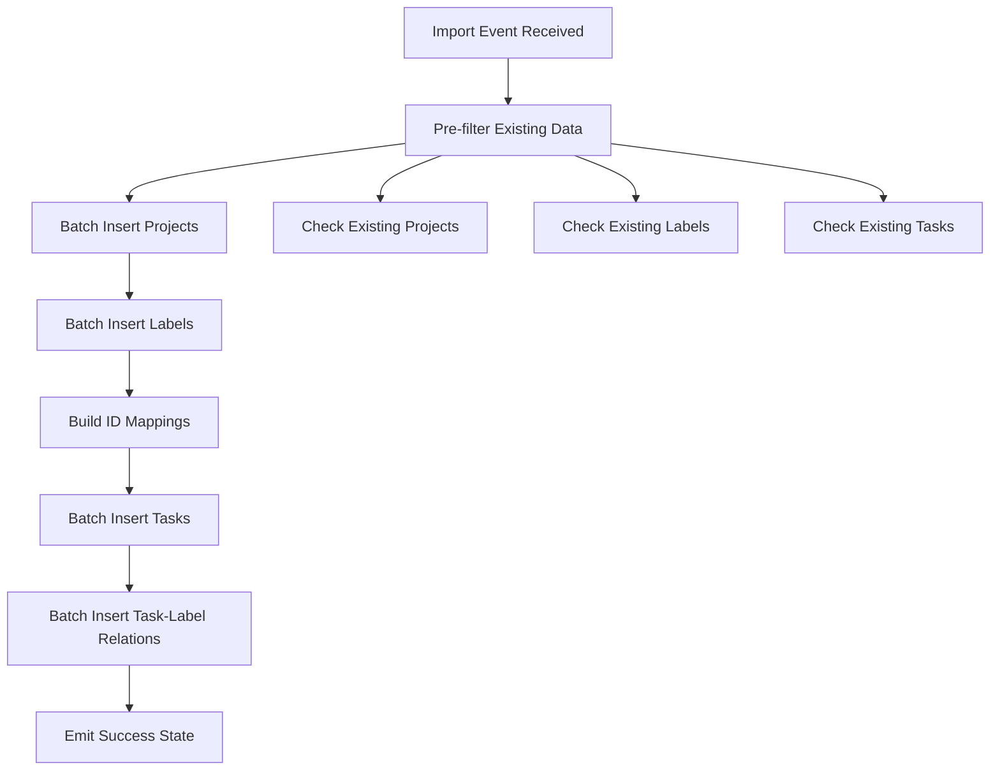

# Design Document

## Overview

This design optimizes the import functionality by replacing individual database operations with batch operations using Drift's transaction capabilities. The current `_onImportInProgress` method processes each project, label, and task individually, resulting in poor performance for large datasets. The optimized solution will group operations into batches and execute them within database transactions.

## Architecture

### Current Architecture Issues
- Individual database calls for each project, label, and task
- Multiple round trips to the database
- No batching of related operations
- Sequential processing without optimization

### Proposed Architecture
- Batch processing using Drift transactions
- Pre-filtering of existing records to avoid unnecessary checks
- Bulk insert operations for new records
- Optimized relationship mapping for task-label associations

## Components and Interfaces

### 1. Enhanced Database Layer Methods

#### ProjectDB Enhancements
```dart
// New batch insert method
Future<void> batchInsertProjects(List<Project> projects) async {
  return await _db.transaction(() async {
    for (var project in projects) {
      await _db.into(_db.project).insertOnConflictUpdate(
        ProjectCompanion(
          id: project.id != null ? Value(project.id!) : Value.absent(),
          name: Value(project.name),
          colorCode: Value(project.colorValue),
          colorName: Value(project.colorName),
        ),
      );
    }
  });
}

// Batch existence check
Future<Set<String>> getExistingProjectNames(List<String> names) async {
  final query = _db.select(_db.project)
    ..where((tbl) => tbl.name.isIn(names));
  final results = await query.get();
  return results.map((p) => p.name).toSet();
}
```

#### LabelDB Enhancements
```dart
// New batch insert method
Future<void> batchInsertLabels(List<Label> labels) async {
  return await _db.transaction(() async {
    for (var label in labels) {
      await _db.into(_db.label).insertOnConflictUpdate(
        LabelCompanion(
          id: label.id != null ? Value(label.id!) : Value.absent(),
          name: Value(label.name),
          colorCode: Value(label.colorValue),
          colorName: Value(label.colorName),
        ),
      );
    }
  });
}

// Batch existence check
Future<Set<String>> getExistingLabelNames(List<String> names) async {
  final query = _db.select(_db.label)
    ..where((tbl) => tbl.name.isIn(names));
  final results = await query.get();
  return results.map((l) => l.name).toSet();
}
```

#### TaskDB Enhancements
```dart
// New batch insert method for tasks
Future<List<int>> batchInsertTasks(List<Task> tasks) async {
  return await _db.transaction(() async {
    List<int> insertedIds = [];
    
    for (var task in tasks) {
      int id = await _db.into(_db.task).insert(
        TaskCompanion(
          id: task.id != null ? Value(task.id!) : Value.absent(),
          title: Value(task.title),
          projectId: Value(task.projectId),
          comment: Value(task.comment),
          dueDate: Value(DateTime.fromMillisecondsSinceEpoch(task.dueDate)),
          priority: Value(task.priority.index),
          status: Value(task.tasksStatus!.index),
          order: Value(await _orderForNewTask()),
        ),
      );
      insertedIds.add(id);
    }
    
    return insertedIds;
  });
}

// Batch insert task-label relationships
Future<void> batchInsertTaskLabels(List<TaskLabelRelation> relations) async {
  return await _db.transaction(() async {
    for (var relation in relations) {
      await _db.into(_db.taskLabel).insertOnConflictUpdate(
        TaskLabelCompanion(
          taskId: Value(relation.taskId),
          labelId: Value(relation.labelId),
        ),
      );
    }
  });
}

// Check existing tasks by title
Future<Set<String>> getExistingTaskTitles(List<String> titles) async {
  final query = _db.select(_db.task)
    ..where((tbl) => tbl.title.isIn(titles));
  final results = await query.get();
  return results.map((t) => t.title).toSet();
}
```

### 2. Optimized Import Bloc Method

The `_onImportInProgress` method will be restructured to:

1. **Pre-filter existing records** - Check what already exists to avoid unnecessary operations
2. **Batch process projects** - Insert all new projects in a single transaction
3. **Batch process labels** - Insert all new labels in a single transaction  
4. **Batch process tasks** - Insert all new tasks in a single transaction
5. **Batch process relationships** - Create task-label relationships in batches

### 3. Data Models

#### TaskLabelRelation Model
```dart
class TaskLabelRelation {
  final int taskId;
  final int labelId;
  
  TaskLabelRelation({required this.taskId, required this.labelId});
}
```

## Data Models

### Enhanced Import Processing Flow



### Performance Optimization Strategy

1. **Reduce Database Round Trips**: Instead of N individual queries, use 3-4 batch operations
2. **Transaction Efficiency**: Group related operations in single transactions
3. **Memory Optimization**: Process data in chunks if dealing with very large datasets
4. **Existence Checking**: Bulk check existing records to avoid duplicate processing

## Error Handling

### Transaction Rollback Strategy
- All batch operations wrapped in transactions
- If any operation fails, entire batch rolls back
- Detailed error reporting with specific failure points
- Graceful degradation to individual operations if batch fails

### Error Recovery
```dart
try {
  await batchInsertProjects(newProjects);
} catch (e) {
  // Log batch failure and attempt individual inserts
  logger.warning('Batch project insert failed, falling back to individual inserts: $e');
  for (var project in newProjects) {
    try {
      await _projectDB.insertProject(project);
    } catch (individualError) {
      logger.error('Failed to insert project ${project.name}: $individualError');
    }
  }
}
```

## Testing Strategy

Manual testing with real APK data after implementation to verify performance improvements and data integrity.

## Implementation Phases

### Phase 1: Database Layer Enhancement
- Add batch insert methods to ProjectDB, LabelDB, TaskDB
- Implement existence checking methods
- Add transaction wrappers for batch operations

### Phase 2: Import Bloc Optimization
- Refactor `_onImportInProgress` method
- Implement pre-filtering logic
- Add batch processing workflow
- Enhance error handling and logging