# Flutter Auto-Update Feature Design Document

## Overview

This document outlines the design for implementing automatic update functionality in the WhatTodo Flutter application. The feature will enable over-the-air (OTA) updates by detecting new releases from GitHub, downloading APK files, and guiding users through the installation process with comprehensive UI feedback.

### Core Objectives
- Implement automatic version checking with daily silent checks
- Provide intuitive update notifications using badges and dialog interfaces
- Display download progress in both notification bar and main UI
- Enable seamless APK installation with proper permission handling
- Integrate with existing BLoC architecture and logging system

### Target Platforms
- Android (primary focus)
- Future expansion to iOS and desktop platforms

## Architecture

### Integration with Existing System
The auto-update feature will integrate seamlessly with the current BLoC-based architecture:

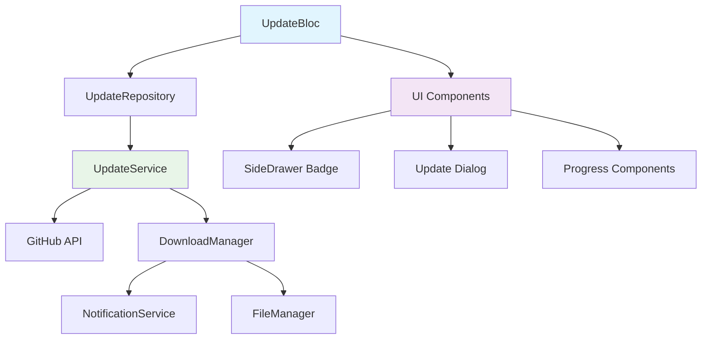

### Component Architecture

#### Core Components Overview
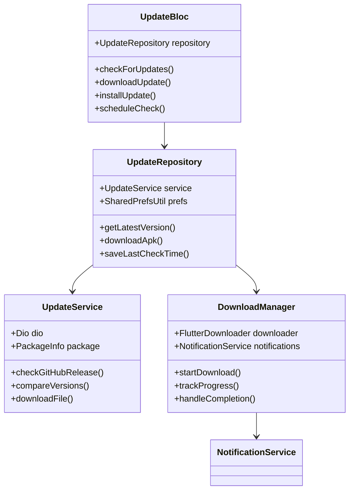

## Technology Stack & Dependencies

### New Dependencies
The following packages will be added using FVM commands:

| Package | Purpose | Version Strategy |
|---------|---------|------------------|
| dio | HTTP client with interceptors | Auto-resolved |
| package_info_plus | Current app version | Auto-resolved |
| pub_semver | Version comparison | Auto-resolved |
| flutter_downloader | File download management | Auto-resolved |
| open_filex | APK installation | Auto-resolved |
| flutter_local_notifications | Progress notifications | Auto-resolved |
| badges | Visual update indicators | Auto-resolved |

### Dependency Installation Commands
```bash
fvm flutter pub add dio
fvm flutter pub add package_info_plus
fvm flutter pub add pub_semver
fvm flutter pub add flutter_downloader
fvm flutter pub add open_filex
fvm flutter pub add flutter_local_notifications
fvm flutter pub add badges
```

### Network Configuration
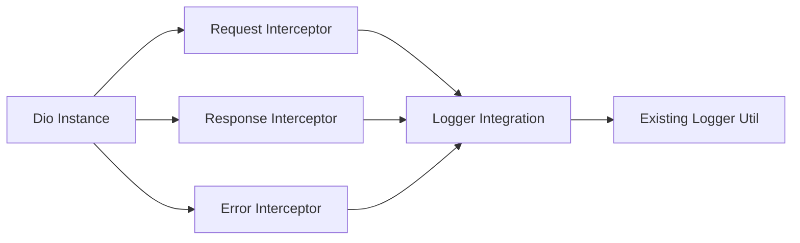

## Data Models & State Management

### Update Models
```dart
// Version Information Model
class VersionInfo {
  final String version;
  final String downloadUrl;
  final String releaseNotes;
  final DateTime publishedAt;
  final int fileSize;
}

// Update State Model
abstract class UpdateState extends Equatable {
  const UpdateState();
}

class UpdateInitial extends UpdateState {}
class UpdateChecking extends UpdateState {}
class UpdateAvailable extends UpdateState {
  final VersionInfo versionInfo;
}
class UpdateDownloading extends UpdateState {
  final double progress;
  final String fileName;
}
class UpdateDownloaded extends UpdateState {
  final String filePath;
}
class UpdateError extends UpdateState {
  final String message;
}
```

### BLoC Event System
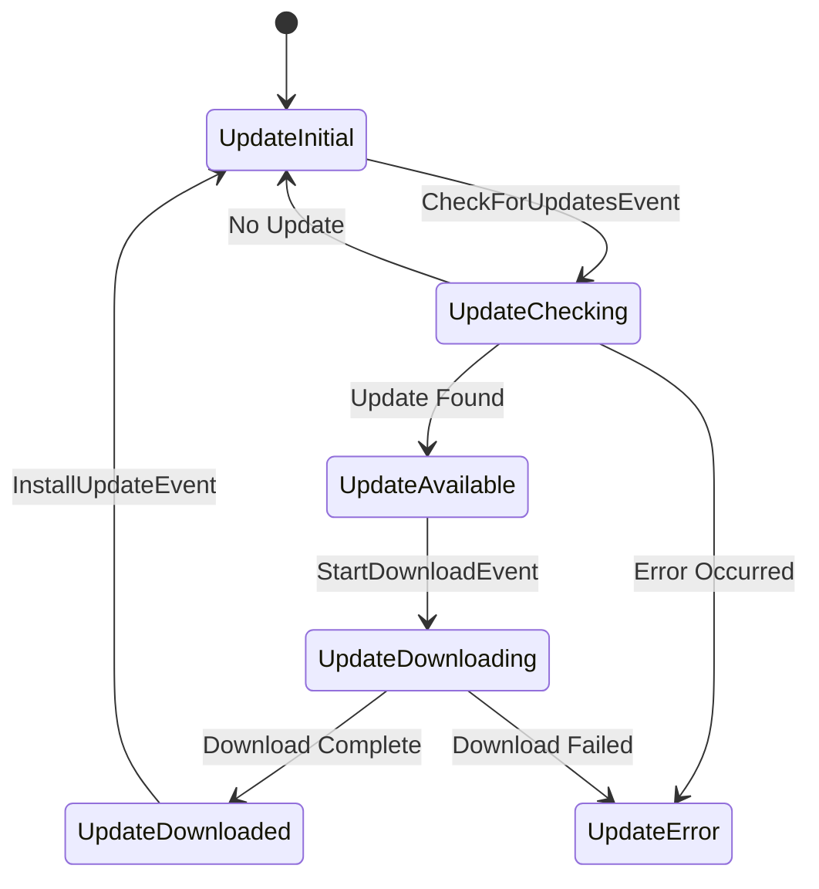

## API Integration Layer

### GitHub Release API Integration
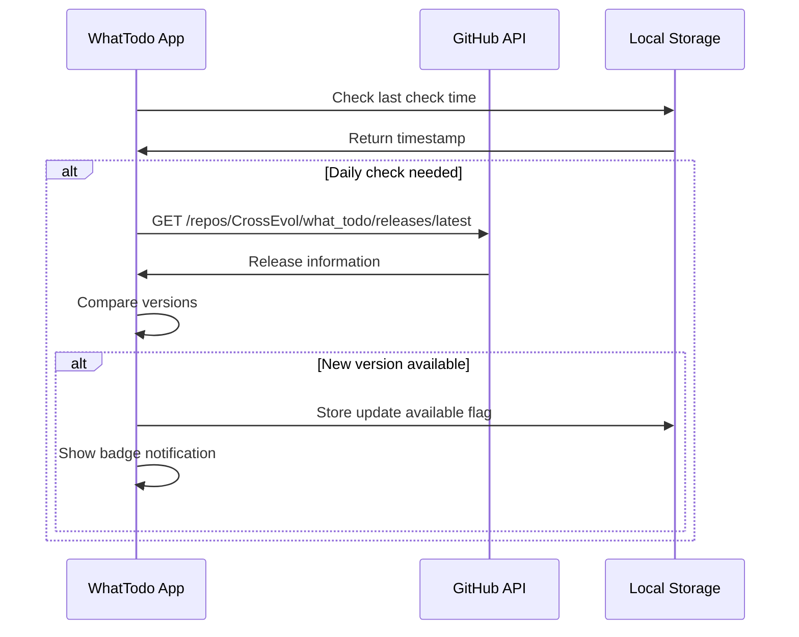

### Network Request Structure
```dart
class UpdateService {
  final Dio _dio;
  final ILogger _logger;
  
  Future<VersionInfo?> checkLatestVersion() async {
    try {
      final response = await _dio.get(
        'https://api.github.com/repos/CrossEvol/what_todo/releases/latest'
      );
      return VersionInfo.fromJson(response.data);
    } catch (e) {
      _logger.error('Update check failed: $e');
      return null;
    }
  }
}
```

## UI Components Design

### SideDrawer Integration
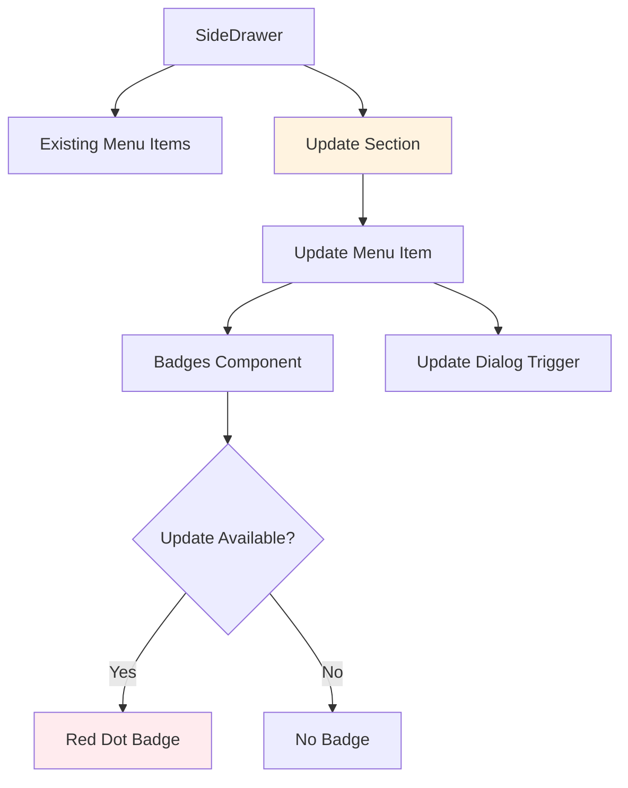

### Update Dialog Components
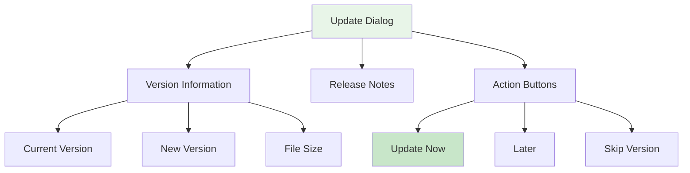

### Progress Display Components
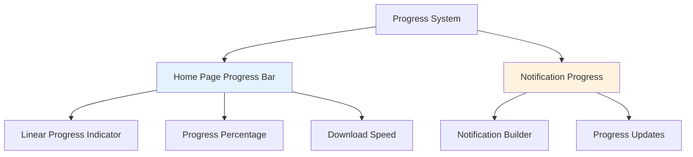

## Business Logic Layer

### Update Check Scheduling
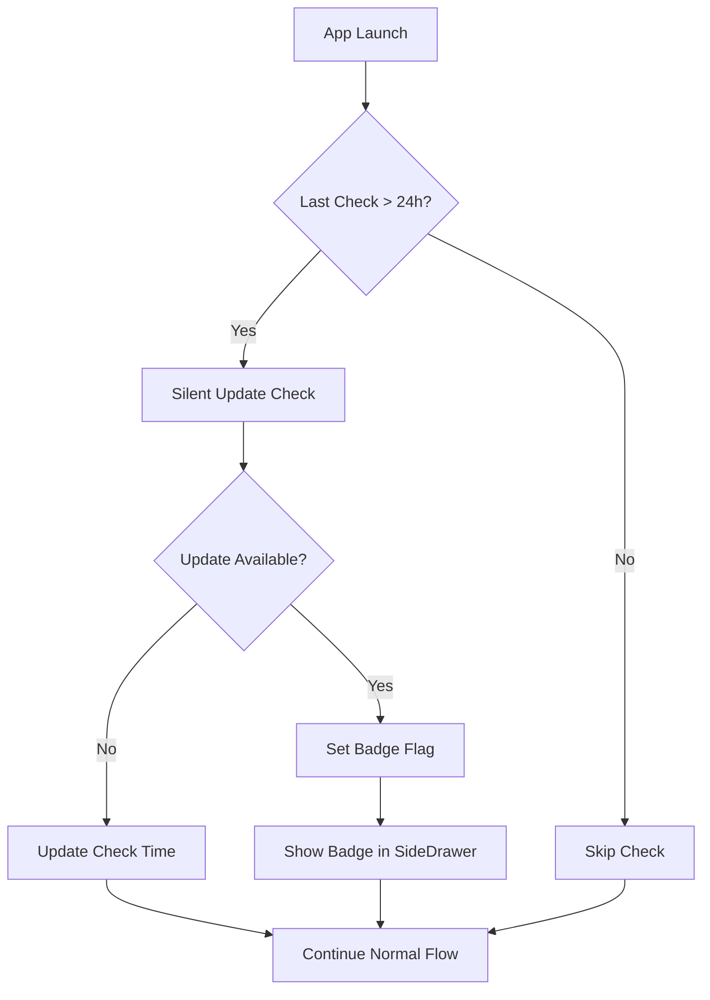

### Version Comparison Logic
```dart
class VersionComparator {
  static bool isNewerVersion(String current, String latest) {
    final currentVersion = Version.parse(current);
    final latestVersion = Version.parse(latest);
    return latestVersion > currentVersion;
  }
}
```

### Download Management
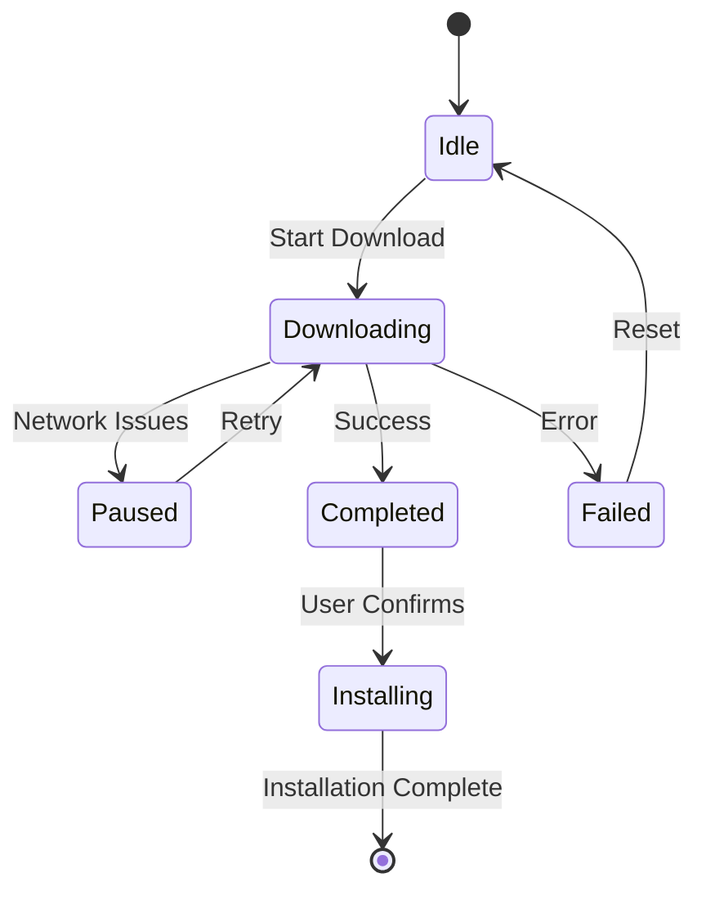

## Permissions & Platform Configuration

### Android Manifest Configuration
```xml
<!-- Required Permissions -->
<uses-permission android:name="android.permission.INTERNET" />
<uses-permission android:name="android.permission.WRITE_EXTERNAL_STORAGE" />
<uses-permission android:name="android.permission.REQUEST_INSTALL_PACKAGES" />
<uses-permission android:name="android.permission.POST_NOTIFICATIONS" />

<!-- FileProvider Configuration -->
<provider
    android:name="androidx.core.content.FileProvider"
    android:authorities="${applicationId}.provider"
    android:exported="false"
    android:grantUriPermissions="true">
    <meta-data
        android:name="android.support.FILE_PROVIDER_PATHS"
        android:resource="@xml/provider_paths" />
</provider>
```

### Provider Paths Configuration
```xml
<!-- android/app/src/main/res/xml/provider_paths.xml -->
<?xml version="1.0" encoding="utf-8"?>
<paths xmlns:android="http://schemas.android.com/apk/res/android">
    <external-path name="external_files" path="."/>
    <cache-path name="cache" path="."/>
</paths>
```

## Security & Privacy

### Security Measures
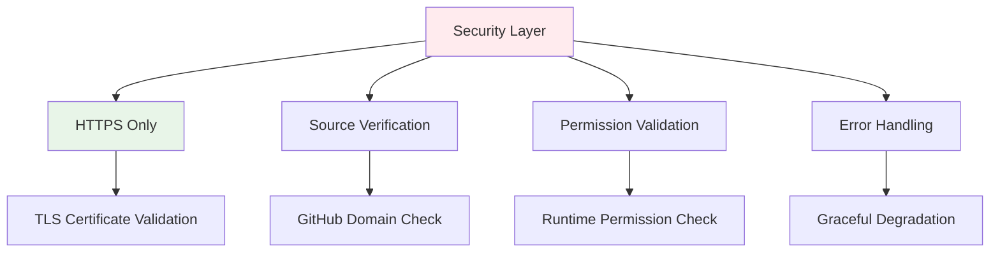

### Privacy Considerations
- No personal data collection for update checks
- Local storage of update preferences only
- Transparent permission requests with clear explanations
- User control over update timing and installation

## Testing Strategy

### Unit Testing Scope
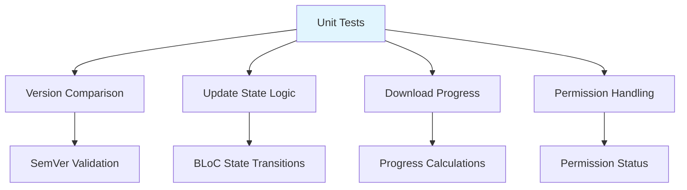

### Integration Testing
- Badge visibility and interaction
- Download progress synchronization
- Notification system integration
- File system access validation

### Test Data Structure
```dart
class UpdateTestData {
  static const mockVersionResponse = {
    'tag_name': 'v2.0.0',
    'name': 'Version 2.0.0',
    'body': 'Release notes here',
    'assets': [
      {
        'name': 'app-release.apk',
        'browser_download_url': 'https://github.com/...',
        'size': 25000000
      }
    ]
  };
}
```

## Error Handling & User Experience

### Error Scenarios
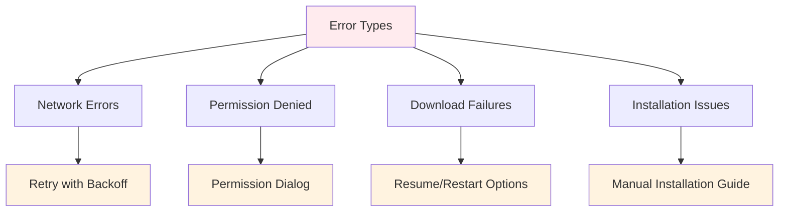

### User Feedback System
- Clear error messages with actionable solutions
- Progress indicators with time estimates
- Success confirmations and next steps
- Fallback options for failed operations

## Performance & Optimization

### Resource Management
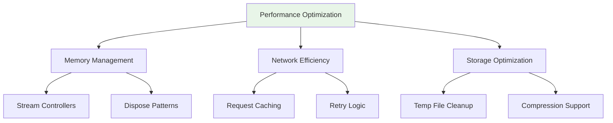

### Optimization Strategies
- Lazy loading of update components
- Efficient progress reporting (throttled updates)
- Background download with minimal UI impact
- Cleanup of temporary files after installation

## Future Enhancements

### Planned Features
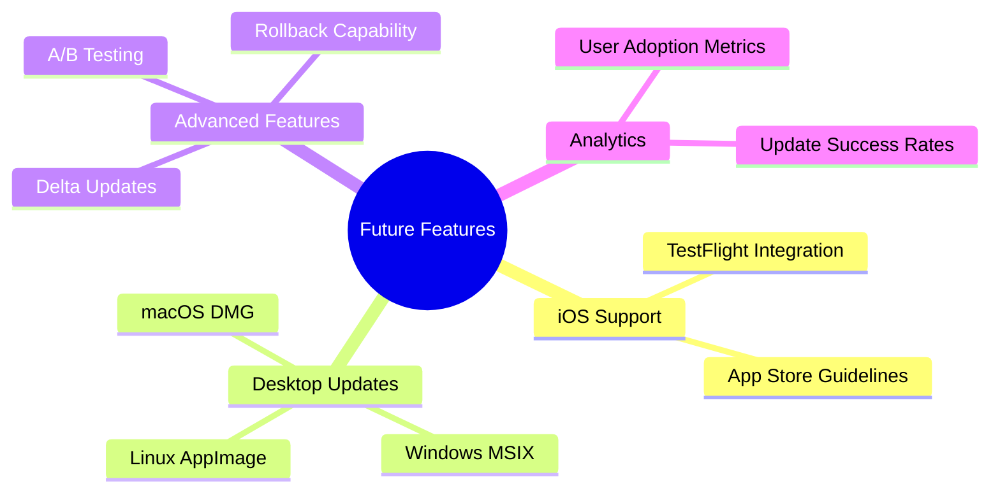

### Extensibility Points
- Plugin architecture for different update sources
- Customizable UI themes for update dialogs
- Integration with crash reporting systems
- Support for staged rollouts and feature flags