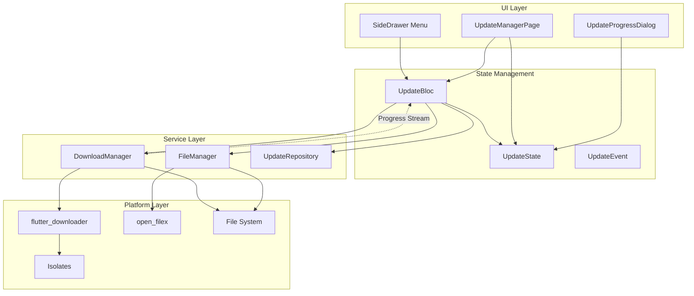
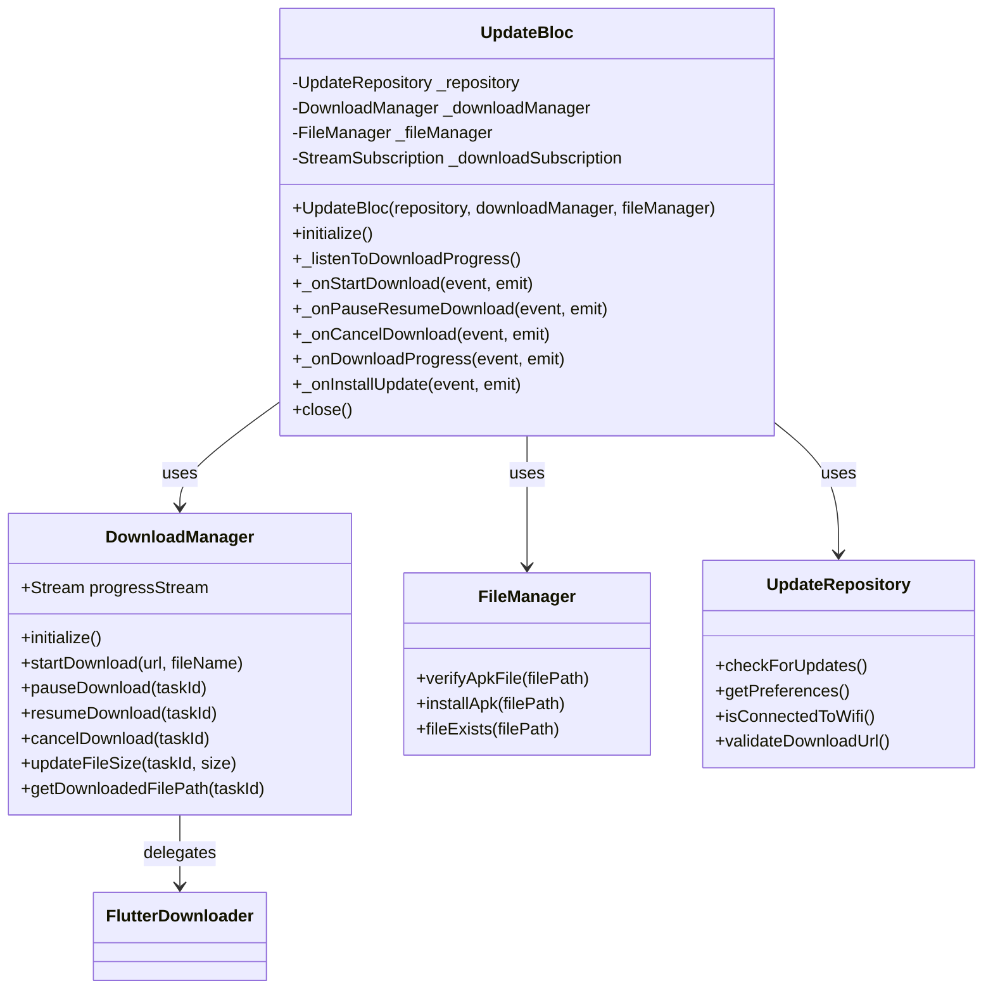
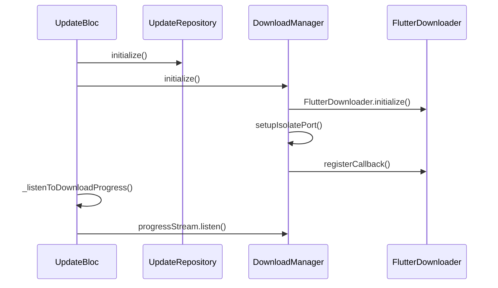
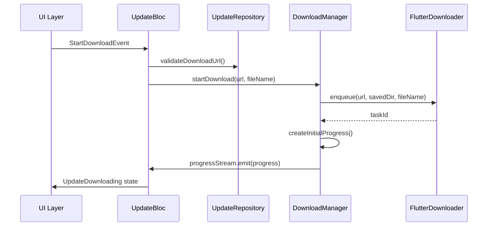
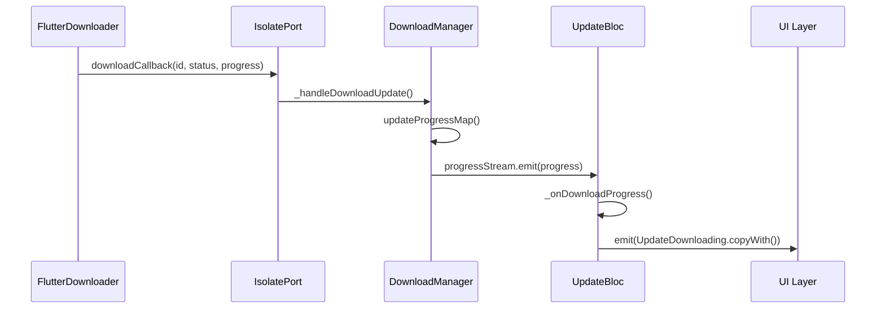
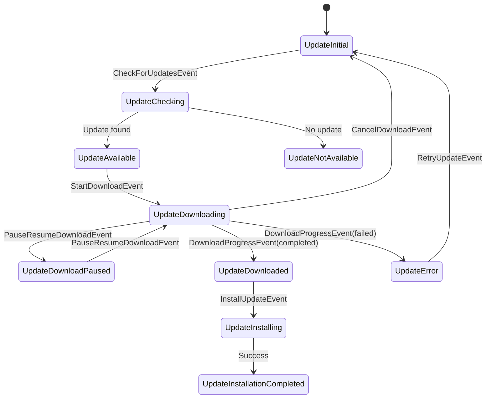
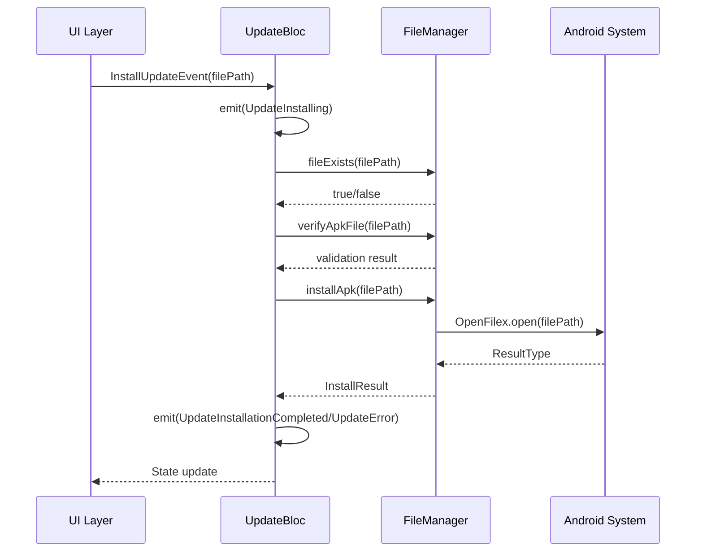
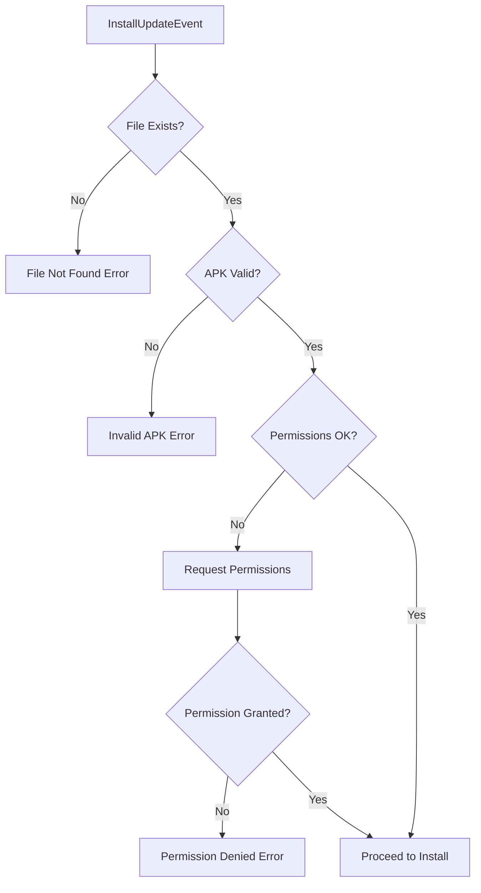
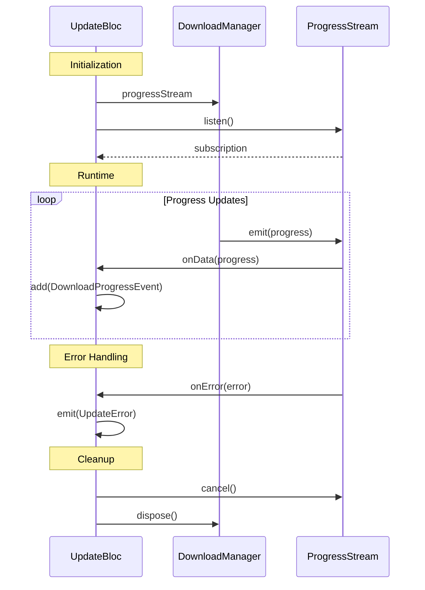
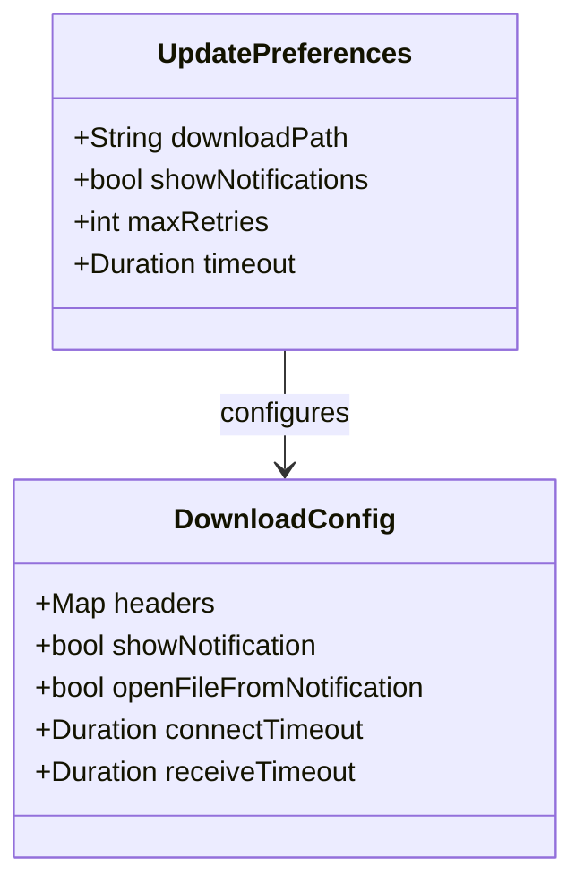

# Update System Architecture

## Overview

This document outlines the architectural design of the WhatTodo application's update system, which consists of three integrated components:
1. UpdateBloc-DownloadManager integration for APK downloads
2. APK installation logic implementation
3. Update manager UI with multiple download options

## Technology Stack & Dependencies

### Core Dependencies
- **flutter_bloc**: State management framework
- **flutter_downloader**: APK download engine
- **open_filex**: APK installation via system installer
- **path_provider**: File system access
- **equatable**: Value equality for BLoC events/states

### Core Components
- **UpdateBloc**: Central state management for the update workflow
- **DownloadManager**: Handles APK download operations
- **FileManager**: Manages file operations and APK installation
- **UpdateRepository**: Data persistence for update preferences
- **UpdateManagerPage**: UI for managing updates with multiple download options

## Architecture

### Component Integration Overview



### UpdateBloc Architecture



## Core Features

### 1. Multi-Option Download Management

#### Download Options
The UpdateManagerPage supports two distinct download options:
1. **Official What_todo Updates**: GitHub releases from the official repository

#### Download Option Configuration
```dart
enum DownloadOption {
  official('Official What_todo Update'),
  
  const DownloadOption(this.displayName);
  final String displayName;
}

class OfficialUpdateOption {
  static const String repositoryUrl = 'burhanrashid52/WhatTodo';
  static const String apiEndpoint = 'https://api.github.com/repos/burhanrashid52/WhatTodo/releases/latest';
  static const String displayName = 'What_todo Official Update';
  static const bool requiresVersionCheck = true;
}

```

### 2. Download Workflow Integration

#### Component Initialization


#### Download Process Flow


#### Progress Updates Flow


### 3. APK Installation Integration

#### FileManager Integration
The UpdateBloc integrates with FileManager to leverage existing APK installation capabilities:

- **File Verification**: Validate APK integrity before installation
- **Permission Handling**: Ensure install permissions are granted
- **Installation Triggering**: Use OpenFilex to launch system installer
- **Result Processing**: Handle installation outcomes and errors

#### Installation Process Flow
1. **State Transition**: `UpdateDownloaded` → `UpdateInstalling`
2. **File Validation**: Verify APK exists and is valid
3. **Permission Check**: Ensure install permissions (handled by FileManager)
4. **Installation Trigger**: Use FileManager.installApk()
5. **Result Handling**: Process InstallResult and emit appropriate state

## State Management

### Download States Mapping

| DownloadTaskStatus | DownloadStatus | UpdateState |
|-------------------|----------------|-------------|
| enqueued | pending | UpdateDownloading |
| running | downloading | UpdateDownloading |
| paused | paused | UpdateDownloadPaused |
| complete | completed | UpdateDownloaded |
| failed | failed | UpdateError |
| canceled | cancelled | UpdateInitial |

### Installation States
- **UpdateInstalling**: Indicates installation in progress
- **UpdateInstallationCompleted**: Installation successfully initiated
- **UpdateError**: Installation failed with specific error types

### State Flow Diagram



### State Transition Sequence



## Event-State Flow Patterns

### Download Lifecycle Events

```mermaid
flowchart TD
    A[DownloadProgressEvent] --> B{Current State Check}
    B -->|UpdateDownloading| C{Progress Status}
    B -->|UpdateDownloadPaused| C
    B -->|Other| Z[Log Warning & Return]
    
    C -->|completed| D[Get File Path]
    C -->|failed| E[Emit UpdateError]
    C -->|cancelled| F[Emit UpdateInitial]
    C -->|downloading/paused| G[Update Progress]
    
    D --> H{File Path Valid?}
    H -->|Yes| I[Emit UpdateDownloaded]
    H -->|No| J[Emit UpdateError]
    
    G --> K[Emit State.copyWith(progress)]
```

### Installation Workflow



## Stream Management & Resource Handling

### Subscription Lifecycle



## Error Handling Strategy

### Error Types and Responses

| Error Type | Trigger Condition | Response State | Recovery Action |
|------------|------------------|----------------|-----------------|
| File Not Found | APK file missing | UpdateError | Re-download |
| Invalid APK | Corrupted/invalid file | UpdateError | Re-download |
| Permission Denied | Install permission refused | UpdateError | Manual retry |
| Installation Failed | System installer error | UpdateError | Manual retry |
| Network Error | Connectivity issues | UpdateError | Retry |
| Download Failed | Download interruption | UpdateError | Retry |

### FileManager Error Mapping
| FileManager Result | UpdateErrorType | User Message |
|-------------------|-----------------|--------------|
| ResultType.done | Success | "Installation started successfully" |
| ResultType.fileNotFound | fileNotFound | "APK file not found" |
| ResultType.noAppToOpen | installationFailed | "No app available to install APK" |
| ResultType.permissionDenied | installationFailed | "Permission denied for installation" |
| ResultType.error | installationFailed | Custom error message |

## UI Integration Considerations

### UpdateManagerPage Layout

```mermaid
graph TD
    subgraph "Page Structure"
        AB[AppBar: "Update Manager"]
        
        subgraph "Download Options Section"
            DO1[RadioTile: "Official What_todo Update"]
            DO2[RadioTile: "Test APK Download"]
        end
        
        subgraph "Action Buttons"
            CD[Check for Updates - Official Only]
            SD[Start Download]
            PP[Pause/Resume Button]
            CN[Cancel Button]
            IN[Install Button]
        end
        
        subgraph "Progress Display"
            ST[Status Text]
            PT[Progress Text]
            PB[Linear Progress Bar]
        end
        
        subgraph "Logs Section"
            LT[Log Title]
            LL[Scrollable Log List]
        end
    end
```

### Interactive States

| State | Start Download | Pause/Resume | Cancel | Install | Check Updates |
|-------|---------------|-------------|--------|---------|---------------|
| Initial | Enabled | Hidden | Hidden | Hidden | Enabled (Official) |
| Downloading | Disabled | Enabled (Pause) | Enabled | Hidden | Disabled |
| Paused | Disabled | Enabled (Resume) | Enabled | Hidden | Disabled |
| Downloaded | Disabled | Hidden | Hidden | Enabled | Enabled (Official) |
| Installing | Disabled | Hidden | Hidden | Disabled | Disabled |
| Error | Enabled | Hidden | Hidden | Hidden | Enabled (Official) |

### Navigation Integration

The UpdateManagerPage integrates into the existing GoRouter configuration:

```dart
GoRoute(
  path: 'update_manager',
  builder: (BuildContext context, GoRouterState state) {
    return const UpdateManagerPage();
  },
)
```

## Performance Considerations

### Resource Optimization
- **Memory**: Limited progress map size, cleanup of completed tasks
- **CPU**: Efficient stream processing, minimal state copying
- **Network**: Configurable retry policies, bandwidth-aware downloads
- **Storage**: Temporary file cleanup, compression support

### Background Processing
- **Isolate Usage**: flutter_downloader handles background execution
- **App Lifecycle**: Download continuation across app states
- **Battery Optimization**: Respectful of device power management

## Security Considerations

### APK Validation
- **File Integrity**: Basic header and size validation
- **Extension Check**: Verify .apk file extension
- **Size Verification**: Minimum size requirements

### Permission Model
- **Install Permissions**: Required for APK installation
- **Storage Access**: Managed through path_provider
- **System Integration**: Leverages Android security model

## Configuration & Preferences

### Download Configuration Options

